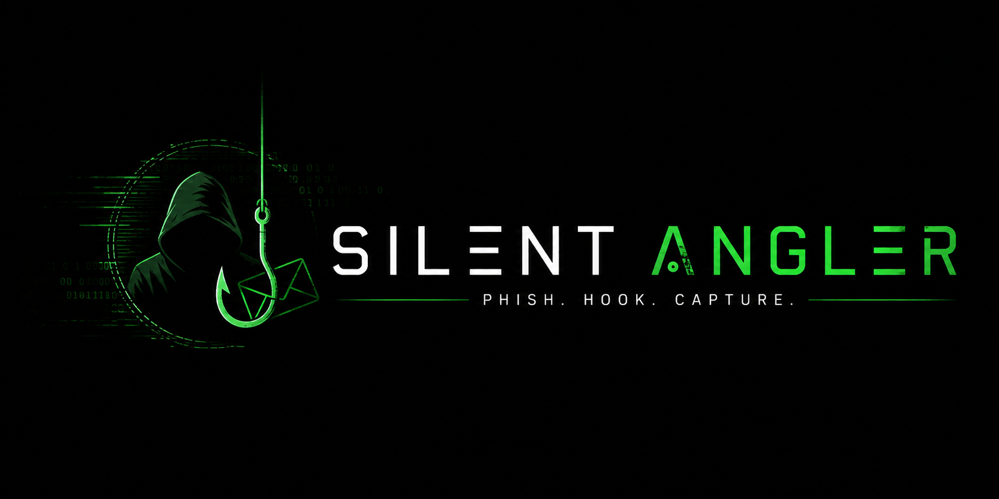

<!-- SilentAngler -->

<p align="center">
  
</p>

<p align="center">
  
  
  
  
  
</p>

<p align="center">
  
  
  
  
  
</p>

<p align="center"><b>A beginner-friendly, automated phishing awareness framework with 44+ templates.</b></p>

##

<h3><p align="center">Disclaimer</p></h3>

<i>Any actions and or activities related to <b>SilentAngler</b> is solely your responsibility. The misuse of this toolkit can result in <b>criminal charges</b> brought against the persons in question. <b>The contributors will not be held responsible</b> in the event any criminal charges be brought against any individuals misusing this toolkit to break the law.

<b>This toolkit contains materials that can be potentially damaging or dangerous for social media</b>. Refer to the laws in your province/country before accessing, using, or in any other way utilizing this in a wrong way.

<b>This Tool is made for educational purposes only</b>. Do not attempt to violate the law with anything contained here. <b>If this is your intention, then Get the hell out of here</b>!

It only demonstrates "how phishing works". <b>You shall not misuse the information to gain unauthorized access to someone's social media</b>. However you may try this out at your own risk.</i>

##

### Features

- 🎭 **44+ Phishing Templates** – Facebook, Google, Instagram, LinkedIn, PayPal, Netflix, and more
- 🧩 **Automatic Data Injection** – Injects scripts into any HTML template
- 🌍 **Cloudflared Tunnel** – Instant public URL generation
- 💻 **Local Server** – Offline testing on `http://localhost:8080`
- ⏱️ **Real-time Data Capture** – With timestamp logging
- 📄 **JSON & Plain Text** – Data export for analysis
- 📋 **One-click Copy to Clipboard** – Copy the generated link instantly
- 🌐 **Auto-open Link in Browser** – For quick testing and research
- 📁 **All Data Saved** – IPs, credentials, and URLs are saved in local files

##

## Dependencies & Installation
## 🧰 Creating a Virtual Environment (Linux)

SilentAngler is a **bash script** and does not require Python or Node.js.  
However, if you want to isolate dependencies for other tools or testing, you can create a Python virtual environment.

### Step 1: Install Python virtual environment tools

```bash
sudo apt install -y python3-venv python3-pip
```

Step 2: Create a virtual environment

```bash
python3 -m venv silentangler_env
```

Step 3: Activate the virtual environment

```bash
source silentangler_env/bin/activate
```

Step 4: Install any Python-based dependencies (optional)

```bash
pip install requests
```

Step 5: Deactivate when done

```bash
deactivate
```

Note: This step is completely optional. SilentAngler runs natively as a bash script and does not require a virtual environment.

---

## Debian / Ubuntu / Kali Linux / Parrot OS

**SilentAngler** requires the following packages to run properly on Linux:

```bash
sudo apt update
sudo apt install -y php php-cli php-curl php-json wget unzip curl git xclip
  ```
- Just, Clone this repository -
```
  git clone https://github.com/codeuser143/silent_angler
  ```

- Now go to cloned directory and run `silent_angler.sh` -
  ```
  $ cd silent_angler
  $ bash silent_angler.sh
  ```

## Arch Linux / Manjaro

```bash
sudo pacman -Syu
sudo pacman -S php php-cli php-curl wget unzip curl git xclip
```
- Just, Clone this repository -
```
  git clone https://github.com/codeuser143/silent_angler
  ```

- Now go to cloned directory and run `silent_angler.sh` -
  ```
  $ cd silent_angler
  $ bash silent_angler.sh
  ```

## Fedora / RHEL / CentOS

```bash
sudo dnf install -y php php-cli php-curl wget unzip curl git xclip
```
- Just, Clone this repository -
```
  git clone https://github.com/codeuser143/silent_angler
  ```

- Now go to cloned directory and run `silent_angler.sh` -
  ```
  $ cd silent_angler
  $ bash silent_angler.sh
  ```

## openSUSE

```bash
sudo zypper refresh
sudo zypper install -y php php-cli php-curl wget unzip curl git xclip
```
- Just, Clone this repository -
```
  git clone https://github.com/codeuser143/silent_angler
  ```

- Now go to cloned directory and run `silent_angler.sh` -
  ```
  $ cd silent_angler
  $ bash silent_angler.sh
  ```

---

## Dependencies & Installation (Termux)

You can easily install silent_angler in Termux by using the following commands:

```bash
pkg update
pkg install -y php wget unzip curl git xclip
git clone https://github.com/codeuser143/silent-angler.git
cd silent-angler
bash silent_angler.sh
```
### A Note : 
***Termux discourages hacking*** .. So never discuss anything related to *zphisher* in any of the termux discussion groups. For more check : [wiki](https://wiki.termux.com/wiki/Hacking)


## Dependencies & Installation (macOS)

```bash
brew install php wget unzip curl git
git clone https://github.com/codeuser143/silent-angler.git
cd silent-angler
bash silent_angler.sh
```

Note: macOS has built-in pbcopy for clipboard support, so xclip is not required.

---

## Installation (Windows - WSL)

If you are using WSL (Windows Subsystem for Linux), follow the Linux installation instructions above inside your WSL terminal.

For native Windows (without WSL):

· Install XAMPP for PHP: https://www.apachefriends.org/
· Install Git Bash to run the script: https://git-scm.com/download/win

---

## Verify Installation

Run these commands to confirm everything is installed:

```bash
php -v
wget --version
unzip -v
curl --version
xclip -version
```
